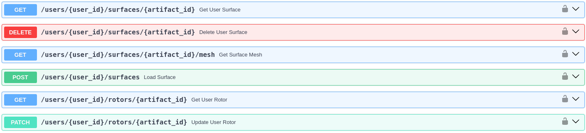
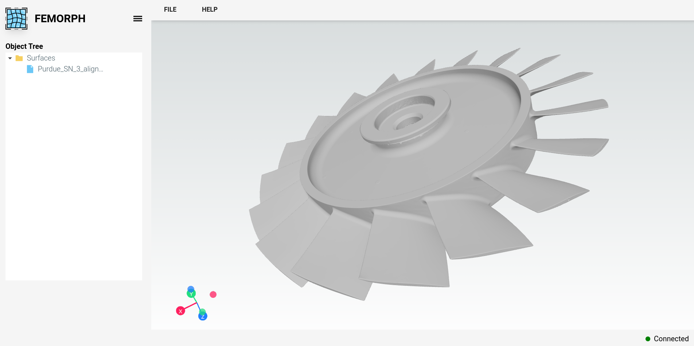

## FEMORPH Web API

A public web API for FEMORPH can be accessed at [api.femorph.com](https://api.femorph.com), which contains a variety of endpoints to allow you to upload both FEMs and surfaces for mesh metamorphosis.

API docs are available at [api.femorph.com/docs](https://api.femorph.com/docs).



### Graphical Web Interface

The public API also contains a graphical user interface which can be accessed from a modern browser by visiting [api.femorph.com](https://api.femorph.com).



Credentials for both this graphical web application and the API can be obtained by visiting [femorph.com](https://www.femorph.com/) and contacting sales.

### Example

The file `example.py` contains everything you need to upload and morph the `cube.cdb` file to the `sphere.ply` file. Once you've obtained your credentials, simply install the requirements and run `python example.py`:

```bash
$ pip install -r requirements.txt
$ python example.py 
Application Healthy
INFO:root:Upload successful: {'filename': 'cube.cdb', 'id': 'c0cf7b82-4735-49e6-9ebb-7358a252bef3', 'dataHash': '0a54ea4bacd3f638c5e069611ba8f18c5dcaeb3867d9067c864f5d8f5cdf9c44', 'dataType': 'FemArtifact', 'modified': False, 'nSectors': None, 'axis': None}
INFO:root:Upload successful: {'filename': 'sphere.ply', 'id': 'cb5c815b-890e-4893-a0dd-f99ad69012a6', 'dataHash': '6b49f02f1ca9cc28cc7507c94198d6c100e8f31d888f8c1660c4ee78e2ab2ce1', 'dataType': 'SurfaceArtifact', 'modified': False, 'nSectors': None, 'axis': None}
INFO:root:Morph request submitted: {'message': 'Submitted morph for fem c0cf7b82-4735-49e6-9ebb-7358a252bef3', 'task_id': '3ed5a1a0-c172-446d-9146-d5ce5393ad31'}
INFO:root:Connected to WebSocket, waiting for task updates...
INFO:root:Task 3ed5a1a0-c172-446d-9146-d5ce5393ad31 status: completed
INFO:root:Downloaded FEM nblock: /tmp/output.inp
PASS
```

Results can be visualized with [mapdl-archive](https://github.com/akaszynski/mapdl-archive).
